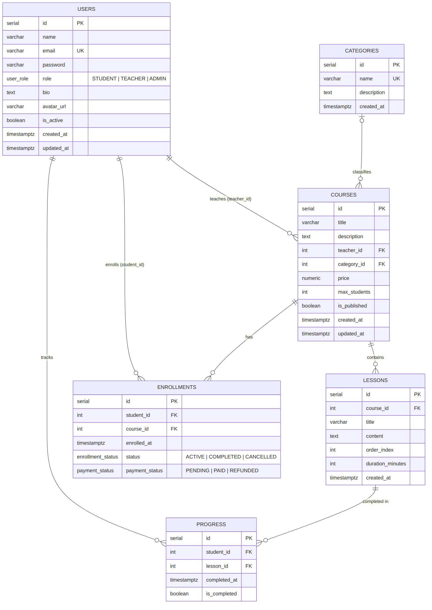

# EduTrack API

> REST API for an online learning platform: courses, lessons, enrollments, per-lesson student progress, reviews and admin reports — with three user roles.


## 🌐 Live Demo

API URL: `https://YOUR-APP.up.railway.app` ← _replace after deploying (see [Deploy](#-deploy-railway))_

## 🛠 Tech Stack

Node.js · TypeScript (strict) · Express · PostgreSQL · Sequelize · MongoDB · Mongoose · JWT · bcrypt · Zod · Helmet · express-rate-limit · Jest · Supertest · Postman/Newman

## ✨ Features

- **3 roles** (`STUDENT`, `TEACHER`, `ADMIN`) with a flexible `requireRoles(...)` middleware.
- **Enrollment business rules**: course must exist and be published, no duplicates (`UNIQUE (student_id, course_id)` + 409), seat limit enforced inside a **transaction with a row lock** (`SELECT … FOR UPDATE`) so concurrent requests can't overbook a course.
- **Per-lesson progress** computed by a PL/pgSQL function `get_student_progress()`; when a student reaches 100% the enrollment switches to `COMPLETED` automatically.
- **Reports** (ADMIN) built with `GROUP BY`, `FILTER`, and subqueries: enrollments per course/month, completion rate, occupancy, revenue per course and per teacher.
- **Dual database**: PostgreSQL for relational data, MongoDB for activity logs (90-day TTL) and course reviews.
- **Security**: bcrypt, JWT, Helmet, CORS, rate limiting (10 auth attempts / 15 min), failed logins logged in MongoDB, same error message whether the email exists or not.
- **Validation** of body, params and query with Zod; centralized error handler that maps Zod / Sequelize / Mongo errors to proper HTTP codes.

## 🗂 Data Model (ERD)



Full SQL (types, tables, indexes, view `vw_course_stats`, function `get_student_progress`): [`database/schema.sql`](database/schema.sql)

MongoDB collections: `activitylogs` (TTL 90 days) and `coursereviews` (unique index `courseId + studentId`).

## 🚀 Installation

**Requirements:** Node.js 20+, PostgreSQL 15+, MongoDB (local or Atlas).

```bash
git clone https://github.com/ujeisson-alt/edutrack-api.git
cd edutrack-api && npm install && cp .env.example .env
# Fill in the variables in .env

createdb edutrack_db          # or create it from pgAdmin
npm run db:reset              # creates types, tables, view and function
npm run db:seed               # demo data (users, courses, lessons, enrollments)
npm run dev                   # http://localhost:3000
```

### Demo users (after `npm run db:seed`)

| Role | Email | Password |
|------|-------|----------|
| ADMIN | admin@edutrack.dev | value of `SEED_PASSWORD` |
| TEACHER | teacher@edutrack.dev | value of `SEED_PASSWORD` |
| STUDENT | student@edutrack.dev | value of `SEED_PASSWORD` |

## 🔐 Environment Variables

| Variable | Required | Description |
|----------|----------|-------------|
| `PORT` | no | Server port (default `3000`) |
| `NODE_ENV` | no | `development` · `test` · `production` |
| `DATABASE_URL` | prod | Full PostgreSQL URL (Railway/Render). Takes priority over `PG_*` |
| `PG_HOST`, `PG_PORT`, `PG_USER`, `PG_PASSWORD`, `PG_DATABASE` | local | Local PostgreSQL connection |
| `PG_SSL` | no | `true` to force SSL (needed for public/external DB URLs; Railway's private `*.railway.internal` URL works without it) |
| `MONGODB_URI` | yes | MongoDB connection string |
| `JWT_SECRET` | yes | At least 32 characters |
| `JWT_EXPIRES_IN` | no | Token lifetime (default `24h`) |
| `FRONTEND_URL` | no | Allowed CORS origin(s), comma separated |
| `SEED_PASSWORD` | seed only | Password for demo users |

The app validates these at startup and refuses to start if something critical is missing.

## 👥 Roles

| Role | Permissions |
|------|-------------|
| STUDENT | Enroll in courses, view lesson content, track progress, leave reviews |
| TEACHER | Create/manage own courses and lessons, view enrolled students of own courses |
| ADMIN | Full access: users, any course, enrollment/payment status, global reports |

## 📡 Endpoints

Base URL: `/api/v1`

| Method | Route | Description | Auth |
|--------|-------|-------------|------|
| POST | `/auth/register` | Register (STUDENT or TEACHER) | Public |
| POST | `/auth/login` | Login and get JWT | Public |
| GET | `/auth/me` | Current user | AUTH |
| GET | `/users` | List users (filters: `role`, `isActive`, `search`, pagination) | ADMIN |
| GET | `/users/:id` | Get user (full if self/admin, public profile otherwise) | AUTH |
| PUT | `/users/:id` | Update profile / change password | AUTH (own) · ADMIN |
| DELETE | `/users/:id` | Deactivate user (soft delete) | ADMIN |
| GET | `/courses` | Published courses (filters: `search`, `categoryId`, `teacherId`, `minPrice`, `maxPrice`, `sortBy`, `order`, pagination) | Public |
| GET | `/courses/:id` | Course with teacher and syllabus | Public |
| POST | `/courses` | Create course | TEACHER · ADMIN |
| PUT | `/courses/:id` | Update / publish course | TEACHER (own) · ADMIN |
| DELETE | `/courses/:id` | Delete course (blocked if it has active enrollments) | ADMIN |
| GET | `/courses/:id/lessons` | Lessons with content | AUTH (owner, admin or enrolled student) |
| POST | `/courses/:id/lessons` | Add lesson | TEACHER (own) · ADMIN |
| PUT | `/courses/:id/lessons/:lessonId` | Edit lesson | TEACHER (own) · ADMIN |
| POST | `/enrollments` | Enroll in a course | STUDENT |
| GET | `/enrollments/my` | My enrollments with progress % | STUDENT |
| GET | `/enrollments/course/:id` | Students enrolled in a course | TEACHER (own) · ADMIN |
| PATCH | `/enrollments/:id/status` | Change status / payment (`PENDING → PAID → REFUNDED`) | ADMIN |
| POST | `/progress` | Mark lesson as completed / pending | STUDENT |
| GET | `/progress/course/:id` | Progress in a course (per lesson + %) | STUDENT |
| GET | `/reports/enrollments` | Enrollment report (`from`, `to`, `categoryId`) | ADMIN |
| GET | `/reports/revenue` | Revenue report per course and teacher | ADMIN |
| POST | `/reviews` | Review a course (enrolled students only, one per course) | STUDENT |
| GET | `/reviews/course/:id` | Reviews + average rating + distribution | Public |
| GET | `/health` _(root)_ | PostgreSQL / MongoDB status | Public |

### Response format

```json
// success
{ "success": true, "data": { ... }, "meta": { "page": 1, "limit": 10, "total": 42, "totalPages": 5 } }

// error
{ "success": false, "message": "Datos de entrada inválidos", "errors": [{ "field": "title", "message": "..." }] }
```

### Example — enroll in a course

```http
POST /api/v1/enrollments
Authorization: Bearer <student token>
Content-Type: application/json

{ "courseId": 1 }
```

```json
{
  "success": true,
  "message": "Inscripción realizada",
  "data": { "id": 4, "studentId": 4, "courseId": 1, "status": "ACTIVE", "paymentStatus": "PENDING", "enrolledAt": "2026-09-30T00:49:23.467Z" }
}
```

| Case | Status |
|------|--------|
| Course not found / not published | 404 |
| Already enrolled | 409 |
| Course full | 409 |
| Not a STUDENT | 403 |
| No / invalid token | 401 |

## 🧪 Testing

**Automated e2e tests (Jest + Supertest)** — 47 tests covering the 3 flows, roles, business rules and error cases. They use a separate PostgreSQL database and an in-memory MongoDB:

```bash
createdb edutrack_test
npm test
# Optional: TEST_PG_DATABASE=other_db  MONGODB_URI_TEST=mongodb://localhost:27017/edutrack_test npm test
```

**Postman** — collection with 42 requests / 68 assertions in [`docs/postman`](docs/postman):

1. Teacher creates a course, adds 3 lessons and publishes it
2. Student enrolls, completes lesson 1 (checks **33.3%** progress) and leaves a review
3. Admin marks the payment as PAID and reads the reports
4. Business rules: full course → 409, missing token → 401, unknown route → 404

```bash
npm run dev            # in one terminal
npm run test:postman   # in another (Newman)
```

## 🏗 Architecture

```
src/
├── config/        # env validation (Zod), Sequelize and Mongoose connections
├── controllers/   # business logic per resource
├── middlewares/   # auth + roles, validation, rate limiting, error handler
├── models/
│   ├── postgres/  # Sequelize models + centralized associations
│   └── mongo/     # ActivityLog, CourseReview
├── routes/        # one router per resource
├── schemas/       # Zod schemas
├── scripts/       # db:reset and db:seed
├── types/         # shared types + Express Request augmentation
└── utils/         # jwt, pagination, activity logger, logger, helpers
```

### Architecture Decisions

- **PostgreSQL** for relational data — native `ENUM` types, `FILTER` aggregates, PL/pgSQL functions and stricter SQL compliance than MySQL.
- **Dual DB** — MongoDB stores activity logs (variable shape, high volume, TTL) and reviews (aggregations for rating distribution).
- **Schema owned by SQL** (`database/schema.sql`), not by `sequelize.sync()`, so the view, function, constraints and indexes are versioned and reviewable.
- **Role-based JWT authorization** with 3 levels plus ownership checks (a teacher can only manage their own courses).
- **Soft delete for users** — keeps enrollment and revenue history consistent.
- **Activity logging never breaks a request** — if MongoDB fails, the error is logged and the main flow continues.
- **Revenue** is calculated from the current course price for `PAID` enrollments (a real payment table is a v2 item).

## ☁️ Deploy (Railway)

1. New project → **Deploy from GitHub repo** → `edutrack-api`.
2. **New → Database → PostgreSQL** (Railway injects `DATABASE_URL`). Reference it in the API service variables.
3. Add variables: `MONGODB_URI` (MongoDB Atlas), `JWT_SECRET`, `NODE_ENV=production`, `FRONTEND_URL`.
4. Railway runs `npm install`, `npm run build` and `npm start` automatically.
5. First deploy only: open the service shell and run `npm run db:reset:prod && npm run db:seed:prod` (define `SEED_PASSWORD` first).
6. Check `https://YOUR-APP.up.railway.app/health` and run the Postman collection with the **Production** environment.

## 🔮 Roadmap (v2)

- Simulated payment system with a payments table
- PDF completion certificates at 100% progress
- Swagger / OpenAPI docs
- Cursor pagination for large catalogs
- Redis cache for the course catalog

## 📄 License

MIT — Jeisson Uribe · [LinkedIn](https://www.linkedin.com/in/jeisson-uribe-qa-data)
